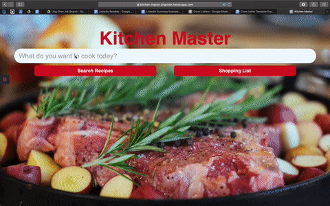

# Kitchen Master

A web application for users to search and browse recipes and if you find that you don't have the ingredients in recipes, you can click on them and it will be automatically added to shopplist.



## Getting Started

### Prerequisites

You need Node.js (v12.16.1) and Redis (v6.0.6) installed to run this app on your local device.

- Instructions for Redis installation: https://redis.io/topics/quickstart
- Instructions for Node.js installation: https://redis.io/topics/quickstart

### Installing Dependencies

```sh
npm install
```

### Starting Redis

```sh
redis-server
```

### Starting Webpack

```sh
npm run build
```

### Starting Server

```sh
npm start
```

## Deployment

This project is deployed on Heroku: http://kitchen-master-jingchen.herokuapp.com

## Authors

- **Jing Chen** - _Initial work_ - [KitchenMaster](https://github.com/jchen0506/KitchenMaster)
